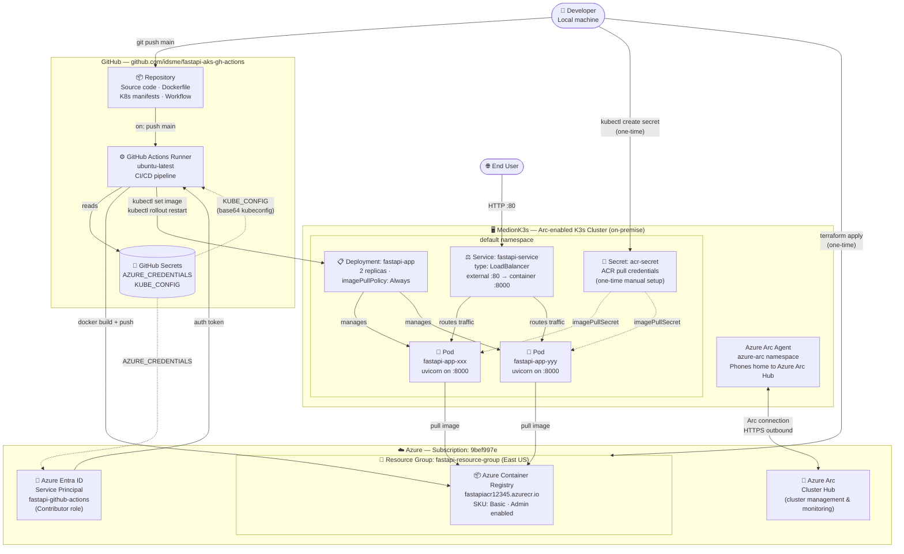

# Application Landscape — FastAPI on MedionK3s (Arc-enabled)

## Full Landscape Diagram



---

## What Must Be Configured in Azure

| Component | How | Status |
|---|---|---|
| **Azure Entra ID — Service Principal** (`fastapi-github-actions`) | `az ad sp create-for-rbac` | ✅ Done |
| **GitHub Secret** `AZURE_CREDENTIALS` | `gh secret set` | ✅ Done |
| **Resource Group** (`fastapi-resource-group`, East US) | `terraform apply` | ⏳ Pending |
| **Azure Container Registry** (`fastapiacr12345.azurecr.io`) | `terraform apply` | ⏳ Pending |
| **Azure Arc** — register MedionK3s as Arc-enabled cluster | Azure Portal or `az connectedk8s connect` | ⏳ Pending |

> **Run once to provision Azure resources:**
> ```bash
> cd infrastructure/terraform
> terraform init
> terraform apply
> ```

---

## What Gets Deployed to MedionK3s

| Component | Kind | How it lands |
|---|---|---|
| **Azure Arc Agent** | Pods in `azure-arc` ns | `az connectedk8s connect` (one-time) |
| **`acr-secret`** | Kubernetes Secret | `kubectl create secret docker-registry` (one-time) |
| **`fastapi-app`** | Deployment (2 pods) | GitHub Actions on every push to `main` |
| **`fastapi-service`** | Service (LoadBalancer) | `kubectl apply -f` on first deploy / `scripts/deploy.sh` |

> **One-time setup commands on MedionK3s:**
>
> **1. Register cluster with Azure Arc:**
> ```bash
> az connectedk8s connect --name MedionK3s --resource-group fastapi-resource-group
> ```
>
> **2. Add GitHub Secret `KUBE_CONFIG`** (run on the machine with kubeconfig access):
> ```bash
> cat ~/.kube/config | base64 -w 0 | gh secret set KUBE_CONFIG --repo idsme/fastapi-aks-gh-actions
> ```
>
> **3. Create ACR pull secret on the cluster:**
> ```bash
> ACR_PASSWORD=$(az acr credential show --name fastapiacr12345 --query passwords[0].value -o tsv)
> kubectl create secret docker-registry acr-secret \
>   --docker-server=fastapiacr12345.azurecr.io \
>   --docker-username=fastapiacr12345 \
>   --docker-password=$ACR_PASSWORD
> ```
>
> **4. Apply Kubernetes manifests (first time only):**
> ```bash
> kubectl apply -f infrastructure/kubernetes/deployment.yaml
> kubectl apply -f infrastructure/kubernetes/service.yaml
> ```

---

## CI/CD Flow (every push to `main`)

```
Developer → git push main
    → GitHub Actions triggers
        → az login (AZURE_CREDENTIALS)
        → docker build
        → docker push → ACR
        → kubectl (KUBE_CONFIG)
            → kubectl set image deployment/fastapi-app
            → kubectl rollout restart
            → kubectl rollout status  ← pipeline blocks here until healthy
```
