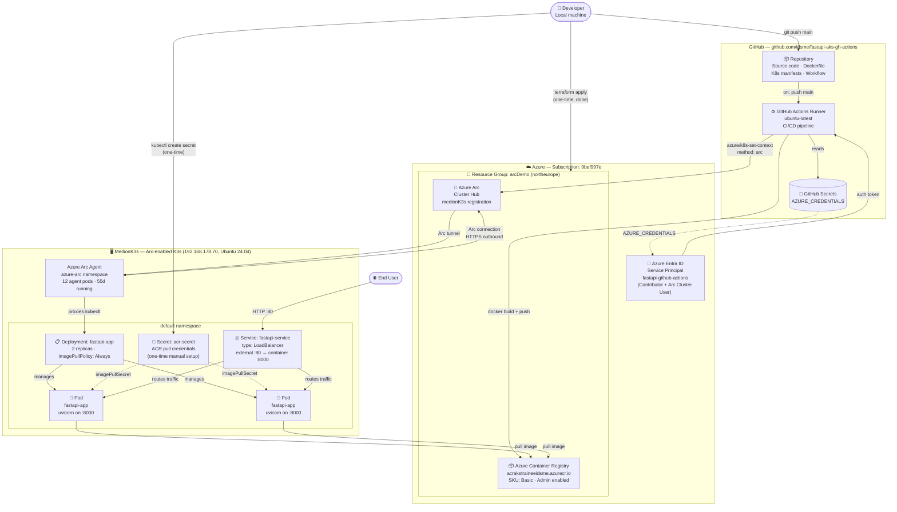

# Application Landscape — FastAPI on MedionK3s (Arc-enabled)

## Full Landscape Diagram



---

## What Is Configured in Azure (Resource Group: arcDemo, northeurope)

| Component | Resource | Status |
|---|---|---|
| **Azure Entra ID** | Service Principal `fastapi-github-actions` | ✅ Active — Contributor + Arc Cluster User Role |
| **GitHub Secret** | `AZURE_CREDENTIALS` | ✅ Configured |
| **Container Registry** | `acrakstraineeidsme.azurecr.io` — Basic SKU | ✅ Provisioned (Terraform managed) |
| **Azure Arc** | `medionK3s` cluster registration | ✅ Connected — K3s v1.34.6, 1 node |

> **To re-provision from scratch:**
> ```bash
> cd infrastructure/terraform
> terraform import azurerm_resource_group.arc_demo .../resourceGroups/arcDemo
> terraform import azurerm_arc_kubernetes_cluster.medion_k3s .../connectedClusters/medionK3s
> terraform import azurerm_container_registry.acr .../registries/acrakstraineeidsme
> terraform apply
> ```

---

## What Is Deployed to MedionK3s (192.168.178.70)

| Component | Kind | How it lands |
|---|---|---|
| **Azure Arc Agent** | 12 pods in `azure-arc` ns | Pre-existing — installed via `az connectedk8s connect` |
| **`acr-secret`** | Kubernetes Secret | `kubectl create secret docker-registry` (one-time) |
| **`fastapi-app`** | Deployment (2 pods) | GitHub Actions on every push to `main` |
| **`fastapi-service`** | Service (LoadBalancer) | Applied once via `kubectl apply` or `scripts/deploy.sh` |

> **One-time setup — create ACR pull secret on MedionK3s:**
> ```bash
> ACR_PASSWORD=$(az acr credential show --name acrakstraineeidsme --query passwords[0].value -o tsv)
> kubectl create secret docker-registry acr-secret \
>   --docker-server=acrakstraineeidsme.azurecr.io \
>   --docker-username=acrakstraineeidsme \
>   --docker-password=$ACR_PASSWORD
> ```

---

## Kubernetes RBAC (Arc identity → K3s)

| ClusterRoleBinding | Azure Object ID | Purpose |
|---|---|---|
| `arc-user-admin` | `e1fe12dd-...` | Owner account Arc proxy access |
| `fastapi-sp-admin` | `bdbfc8ac-...` | GitHub Actions SP deployment access |

---

## CI/CD Flow (every push to `main`)

```
Developer → git push main
    → GitHub Actions triggers
        → azure/login (AZURE_CREDENTIALS)
        → docker build
        → docker push → acrakstraineeidsme.azurecr.io
        → azure/k8s-set-context (method: arc, cluster: medionK3s)
            → Arc tunnel → MedionK3s (192.168.178.70)
                → kubectl set image deployment/fastapi-app
                → kubectl rollout restart
                → kubectl rollout status  ← blocks until healthy
```
